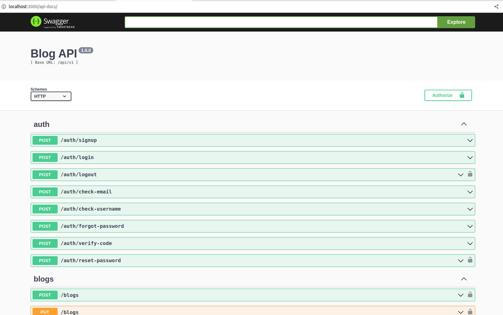

# express-blog-api

Example Node.js Express API web application which maintain blog post data



## Prerequisites

- [Docker (at least 1.10)](https://www.docker.com/)
- [Docker-compose (at least 1.6)](https://docs.docker.com/compose/install/)

## Getting Started

To get up and running on local, simply do the following:

```
$ cd express-blog-api
$ cp .env.example .env
$ docker-compose build
$ docker-compose up
```

To access API documentations, visit `http://localhost:3000/api-docs`.

To stop application,

```
$ cd express-blog-api
$ docker-compose down
```
